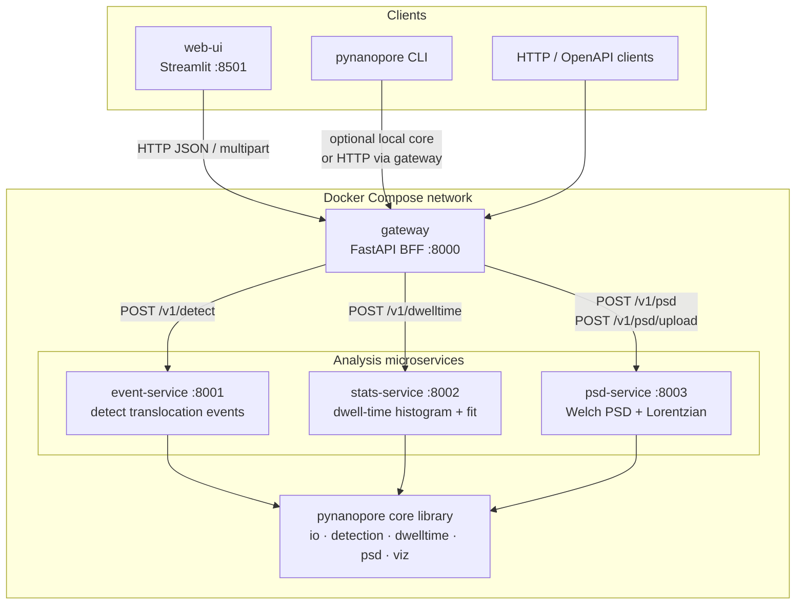
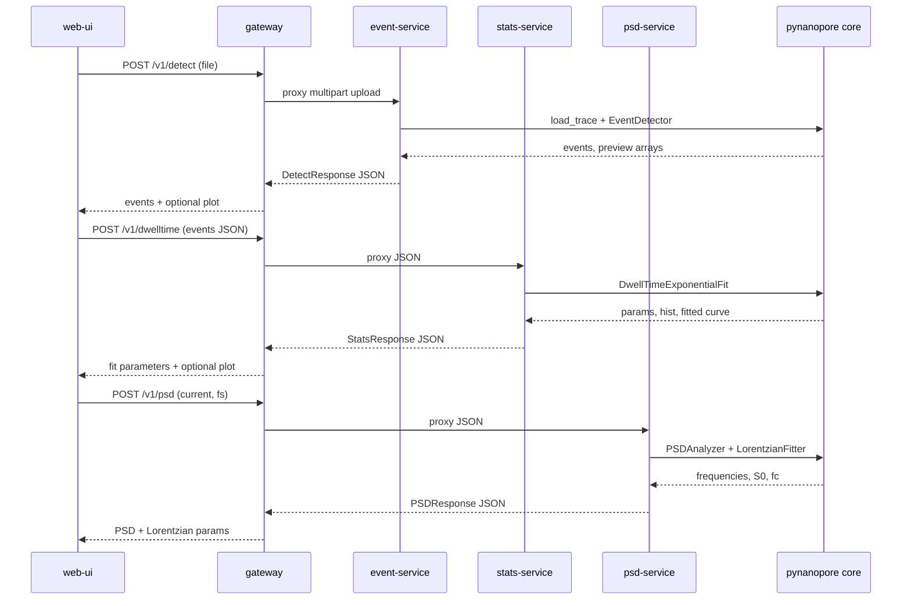

# Pynanopore

Production-oriented toolkit for **single-molecule nanopore electrophysiology** analysis.

It provides:

1. A shared Python library (`pynanopore`) for I/O, event detection, dwell-time fitting, and PSD analysis  
2. FastAPI microservices for those capabilities  
3. An API gateway and Streamlit UI  
4. Docker Compose orchestration for local / production-like runs  

**First analysis tutorial:** [docs/first_analysis.md](docs/first_analysis.md).

**Event detection math** (thresholds, baseline, pulse-shape idealization): see
[docs/event_detection_math.md](docs/event_detection_math.md).

**Dwell-time lifetime fitting** (MLE, AIC/BIC): see
[docs/dwelltime_math.md](docs/dwelltime_math.md).

**PSD models** (Welch, Lorentzian, composite \(1/f\)): see
[docs/psd_math.md](docs/psd_math.md).

**Batch multi-file pipelines**: see
[docs/batch_analysis.md](docs/batch_analysis.md).

## Architecture

Pynanopore is split into a **shared scientific core** and **stateless HTTP microservices**. Clients never call analysis services directly in the Compose deployment: they talk to the **gateway** (BFF), which routes requests, aggregates health, and keeps service URLs internal.

### System overview



### How services communicate

| Hop | Protocol | Payload | Purpose |
|-----|----------|---------|---------|
| `web-ui` → `gateway` | HTTP | multipart file or JSON | Single public entrypoint |
| `gateway` → `event-service` | HTTP proxy | ABF/CSV upload | Preview downsample or threshold event detection |
| `gateway` → `stats-service` | HTTP proxy | JSON list of events | Fit dwell-time distributions |
| `gateway` → `psd-service` | HTTP proxy | current array or file | Estimate PSD / fit Lorentzian |
| each analysis service → core | in-process Python import | NumPy / pandas objects | Shared algorithms (no RPC inside core) |

Typical interactive workflow:

1. User uploads a recording (or loads the example CSV) in **web-ui**.
2. UI calls `POST /v1/preview` for a downsampled trace and draws **live threshold lines**.
3. UI calls `POST /v1/detect` → **event-service** returns events (+ optional Plotly / preview).
4. UI sends those events to `POST /v1/dwelltime` → **stats-service**.
5. UI sends preview current (or re-uploads) to `POST /v1/psd` → **psd-service**.
6. User downloads CSV / JSON / plot HTML·PNG exports from each tab.

`GET /health` on the gateway probes each downstream `/health` endpoint and reports `ok` / `degraded` / `down`.

### Service responsibilities

| Service | Port | Responsibility |
|---------|------|----------------|
| `gateway` | 8000 | BFF: routing, validation pass-through, health aggregation |
| `event-service` | 8001 | Load ABF/CSV → chunked threshold event detection |
| `stats-service` | 8002 | Dwell-time histogram + single/double exponential fit |
| `psd-service` | 8003 | Welch PSD + Lorentzian power-1 fit |
| `web-ui` | 8501 | Streamlit client (calls gateway only; no local analysis) |

### Request sequence (event → stats → PSD)



## Event detection mathematics

Full derivation, parameter guidance, and pulse-shape idealization are documented in
**[docs/event_detection_math.md](docs/event_detection_math.md)**.

Summary: events are found with a dual-threshold rule on a baseline-corrected residual
(canonicalized so events are downward), then characterized with \(I_0\), \(\Delta I/I_0\),
area, and optional rectangular pulse idealization for visualization.


### 1. Baseline statistics

For a chunk of \(N\) samples:

\[
\mu = \frac{1}{N}\sum_{n=1}^{N} I[n],
\qquad
\sigma = \sqrt{\frac{1}{N}\sum_{n=1}^{N}\bigl(I[n]-\mu\bigr)^{2}}
\]

Two downward thresholds are defined from user multipliers \(k_{\mathrm{std}}\) (`std_multiplier`) and \(k_{\mathrm{thr}}\) (`threshold_multiplier`):

\[
T_{\mathrm{entry}} = \mu - k_{\mathrm{std}}\,\sigma
\qquad
T_{\mathrm{deep}} = \mu - k_{\mathrm{thr}}\,\sigma
\]

Defaults are \(k_{\mathrm{std}}=0.25\) and \(k_{\mathrm{thr}}=1.5\), so \(T_{\mathrm{deep}} < T_{\mathrm{entry}} < \mu\) when \(\sigma>0\).  
\(T_{\mathrm{entry}}\) is a **sensitive entry/exit** level; \(T_{\mathrm{deep}}\) is a **confirmation** level that rejects shallow noise spikes.

```text
current I
   ^
   |  ──────── μ (open pore mean)
   |    · · · · T_entry = μ − k_std σ     ← start / end crossings
   |      · · · T_deep  = μ − k_thr σ     ← must be reached inside event
   |         ╲___╱  blockade
   +------------------------------→ time
```

### 2. State-machine detection rule

Scanning samples \(n = 1\ldots N-1\):

1. **Start candidate** when the signal crosses *below* the entry threshold:

\[
I[n-1] \ge T_{\mathrm{entry}} \quad\text{and}\quad I[n] < T_{\mathrm{entry}}
\]

Record \(t_{\mathrm{start}} = t[n]\) and index \(n_{\mathrm{start}}\).

2. **Confirm depth** if, while a candidate is open,

\[
I[n] < T_{\mathrm{deep}}
\]

set a flag that the deep threshold was reached.

3. **End candidate** when the signal crosses *back above* the entry threshold:

\[
I[n-1] < T_{\mathrm{entry}} \quad\text{and}\quad I[n] \ge T_{\mathrm{entry}}
\]

4. **Accept event** only if the deep threshold was reached **and** dwell time meets the minimum:

\[
\tau = t_{\mathrm{end}} - t_{\mathrm{start}} \ge \tau_{\min}
\qquad (\tau_{\min}=10^{-4}\,\mathrm{s}\ \text{by default})
\]

For each accepted event the amplitude is the deepest current in the segment:

\[
A = \min_{n \in [n_{\mathrm{start}},\, n_{\mathrm{end}}]} I[n]
\]

Stored fields: `start_time`, `end_time`, `difference` (\(=\tau\)), `amplitude` (\(A\)).

### 3. Chunking long recordings

Long traces are split into windows of length \(\Delta t\) seconds (`interval_length`, default 5 s). With sample rate \(f_s\):

\[
N_{\mathrm{chunk}} = \lfloor f_s \cdot \Delta t \rfloor
\]

Detection runs independently on each chunk; events are concatenated. Thresholds \(\mu,\sigma\) are **local to each chunk**, which adapts to slow baseline drift but can bias events that straddle chunk boundaries.

### 4. Why two thresholds?

A single threshold tends to either (a) miss shallow true events or (b) accept noise. The dual-threshold rule is a simple hysteresis-style criterion:

- cross \(T_{\mathrm{entry}}\) to mark possible on/off times with high sensitivity;
- require a visit below \(T_{\mathrm{deep}}\) so only excursions with sufficient blockade depth are kept.

This is the logic implemented in `EventDetector` (`packages/pynanopore/src/pynanopore/detection/events.py`).

## Install (library + CLI)

Requires Python 3.10+.

```bash
pip install -e ".[dev,viz,services]"
```

Optional extras:

- `viz` — Plotly helpers  
- `ui` — Streamlit client deps  
- `services` — FastAPI / uvicorn  
- `dev` — pytest, ruff, mypy, pre-commit  

### CLI

```bash
pynanopore detect path/to/file.abf -o events.csv
pynanopore dwelltime events.csv --fit single --bins 50
pynanopore psd path/to/file.abf --fit
```

### Library usage

```python
from pynanopore import load_trace, EventDetector, DwellTimeExponentialFit, PSDAnalyzer

trace = load_trace("recording.abf")
events = EventDetector(0.25, 1.5).detect_trace(trace)
```

## Run microservices (Docker Compose)

```bash
docker compose up --build
```

- UI: http://localhost:8501  
- Gateway OpenAPI: http://localhost:8000/docs  
- Event service docs: http://localhost:8001/docs  

Gateway and analysis services wait on Docker **healthchecks** before dependents start. Useful env vars (compose defaults shown):

| Variable | Default | Purpose |
|----------|---------|---------|
| `LOG_LEVEL` | `INFO` | Service log level |
| `LOG_JSON` | `true` | Structured JSON logs |
| `MAX_UPLOAD_MB` | `100` | Reject larger uploads with HTTP 413 |
| `HTTP_TIMEOUT_S` | `120` | General HTTP timeout setting |
| `DOWNSTREAM_TIMEOUT_S` | `120` | Gateway → service call timeout |

All HTTP responses include `X-Request-ID` (pass one in to correlate gateway → services). Errors use `{ "error": { "code", "message", "request_id", ... } }`.

Pinned dependencies for reproducible installs: [`requirements.lock`](requirements.lock) (use as `pip install ... -c requirements.lock`). Regenerate with:

```bash
pip-compile --strip-extras --extra viz --extra ui --extra services --extra dev -o requirements.lock pyproject.toml
```

### Gateway API overview

- `GET /health` — gateway + downstream health  
- `POST /v1/preview` — multipart upload → downsampled trace for UI tuning  
- `POST /v1/detect` — multipart file upload → events  
- `POST /v1/dwelltime` — JSON events → fit params  
- `POST /v1/psd` — JSON current array → PSD (+ optional Lorentzian)  
- `POST /v1/psd/upload` — file upload → PSD  

## Development

```bash
pip install -e ".[dev,viz,services]"
pre-commit install
ruff check packages services tests
mypy packages/pynanopore/src/pynanopore
pytest
```

## Project layout

```text
packages/pynanopore/src/pynanopore/   # core library
services/
  event-service/
  stats-service/
  psd-service/
  gateway/
  web-ui/
tests/
docker-compose.yml
pyproject.toml
```

## CI / releases

Push/PR to `main` runs lint, typecheck, tests, and wheel build.

Tagged releases (`v*`) publish to PyPI (Trusted Publishing) and push Docker images when secrets are configured (`DOCKER_USERNAME`, `DOCKER_PASSWORD`).

## License

MIT — see [LICENSE](LICENSE).
