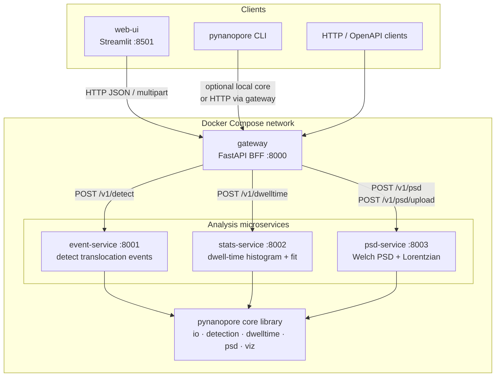
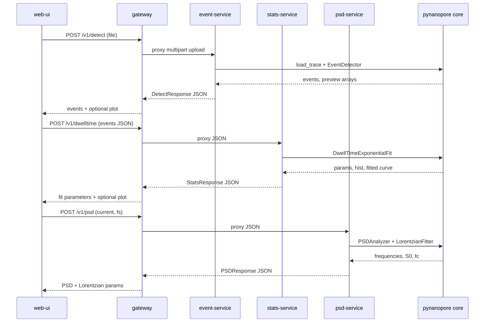

# Pynanopore

Production-oriented toolkit for **single-molecule nanopore electrophysiology** analysis.

It provides:

1. A shared Python library (`pynanopore`) for I/O, event detection, dwell-time fitting, and PSD analysis  
2. FastAPI microservices for those capabilities  
3. An API gateway and Streamlit UI  
4. Docker Compose orchestration for local / production-like runs  

**Science Phase E** (multi-level events, percentile baseline, multi-Lorentzian PSD, parallel batch):
see [docs/science_phase_e.md](docs/science_phase_e.md).

**First analysis tutorial:** [docs/first_analysis.md](docs/first_analysis.md).

**Event detection math** (thresholds, baseline, pulse-shape idealization): see
[docs/event_detection_math.md](docs/event_detection_math.md).

**Dwell-time lifetime fitting** (MLE, AIC/BIC): see
[docs/dwelltime_math.md](docs/dwelltime_math.md).

**PSD models** (Welch, Lorentzian, composite 1/f): see
[docs/psd_math.md](docs/psd_math.md).

**Batch multi-file pipelines**: see
[docs/batch_analysis.md](docs/batch_analysis.md).

**Changelog / releasing:** [CHANGELOG.md](CHANGELOG.md) · [docs/releasing.md](docs/releasing.md).

## Install (2-minute try)

**Library + CLI** (Python ≥ 3.10):

```bash
pip install "pynanopore[viz]"
pynanopore --version
pynanopore detect path/to/recording.csv -o events.csv
```

Use the shipped example after cloning:

```bash
git clone https://github.com/jaybfn/Single-Molecule-Electrophysiology-Data-Analysis.git
cd Single-Molecule-Electrophysiology-Data-Analysis
pip install -e ".[viz]"
pynanopore detect data/test.csv -o events.csv
pynanopore dwelltime events.csv --fit single --method mle
pynanopore psd data/test.csv --fit
```

**Full stack (UI + APIs):**

```bash
docker compose up --build
```

Then open http://localhost:8501 and click **Use example CSV**. Walkthrough: [docs/first_analysis.md](docs/first_analysis.md).

## Architecture

Pynanopore is split into a **shared scientific core** and **stateless HTTP microservices**. Clients never call analysis services directly in the Compose deployment: they talk to the **gateway** (BFF), which routes requests, aggregates health, and keeps service URLs internal.

### System overview



### How services communicate

| Hop | Protocol | Payload | Purpose |
|-----|----------|---------|---------|
| `web-ui` → `gateway` | HTTP | multipart file or JSON | Single public entrypoint |
| `gateway` → `event-service` | HTTP proxy | ABF/CSV upload | Preview downsample or threshold event detection |
| `gateway` → `stats-service` | HTTP proxy | JSON list of events | Fit dwell-time distributions |
| `gateway` → `psd-service` | HTTP proxy | current array or file | Estimate PSD / fit Lorentzian |
| each analysis service → core | in-process Python import | NumPy / pandas objects | Shared algorithms (no RPC inside core) |

Typical interactive workflow:

1. User uploads a recording (or loads the example CSV) in **web-ui**.
2. UI calls `POST /v1/preview` for a downsampled trace and draws **live threshold lines**.
3. UI calls `POST /v1/detect` → **event-service** returns events (+ optional Plotly / preview).
4. UI sends those events to `POST /v1/dwelltime` → **stats-service**.
5. UI sends preview current (or re-uploads) to `POST /v1/psd` → **psd-service**.
6. User downloads CSV / JSON / plot HTML·PNG exports from each tab.

`GET /health` on the gateway probes each downstream `/health` endpoint and reports `ok` / `degraded` / `down`.

### Service responsibilities

| Service | Port | Responsibility |
|---------|------|----------------|
| `gateway` | 8000 | BFF: routing, validation pass-through, health aggregation |
| `event-service` | 8001 | Load ABF/CSV → chunked threshold event detection |
| `stats-service` | 8002 | Dwell-time histogram + single/double exponential fit |
| `psd-service` | 8003 | Welch PSD + Lorentzian power-1 fit |
| `web-ui` | 8501 | Streamlit client (calls gateway only; no local analysis) |

### Request sequence (event → stats → PSD)



## Event detection (overview)

Events use a **dual-threshold** rule on baseline-corrected current (events treated as downward), then store open-pore level *I₀*, relative blockade Δ*I*/*I₀*, area, and optional pulse-shape idealization.

Full equations and parameter guidance: **[docs/event_detection_math.md](docs/event_detection_math.md)**.

### Dual thresholds

For each analysis chunk, estimate the open-pore mean **μ** and std **σ**. Multipliers `std_multiplier` (*k_std*, default **0.25**) and `threshold_multiplier` (*k_thr*, default **1.5**) set:

| Level | Formula | Role |
|-------|---------|------|
| **T_entry** | μ − *k_std* · σ | Sensitive start / end crossings |
| **T_deep** | μ − *k_thr* · σ | Must be reached to confirm a real blockade |

So **T_deep** is below **T_entry**, which is below **μ**, when σ > 0. A candidate is kept only if it crosses below T_entry, visits T_deep, returns above T_entry, and dwell ≥ τ_min (default **0.1 ms**).

```text
current I
   ^
   |  ──────── μ (open pore mean)
   |    · · · · T_entry = μ − k_std · σ   ← start / end crossings
   |      · · · T_deep  = μ − k_thr · σ   ← confirmation depth
   |         ╲___╱  blockade
   +------------------------------→ time
```

Long recordings are split into chunks (`interval_length`, default **5 s**) with **local** μ, σ per chunk — good for slow drift; events that straddle chunk edges can be biased.

Implemented in `EventDetector` (`packages/pynanopore/src/pynanopore/detection/events.py`).

## Install (library + CLI)

Requires Python 3.10+.

```bash
pip install -e ".[dev,viz,services]"
```

Optional extras:

- `viz` — Plotly helpers  
- `ui` — Streamlit client deps  
- `services` — FastAPI / uvicorn  
- `dev` — pytest, ruff, mypy, pre-commit  

### CLI

```bash
pynanopore detect path/to/file.abf -o events.csv
pynanopore dwelltime events.csv --fit single --bins 50
pynanopore psd path/to/file.abf --fit
```

### Library usage

```python
from pynanopore import load_trace, EventDetector, DwellTimeExponentialFit, PSDAnalyzer

trace = load_trace("recording.abf")
events = EventDetector(0.25, 1.5).detect_trace(trace)
```

## Run microservices (Docker Compose)

```bash
docker compose up --build
```

- UI: http://localhost:8501  
- Gateway OpenAPI: http://localhost:8000/docs  
- Event service docs: http://localhost:8001/docs  

Gateway and analysis services wait on Docker **healthchecks** before dependents start. Useful env vars (compose defaults shown):

| Variable | Default | Purpose |
|----------|---------|---------|
| `LOG_LEVEL` | `INFO` | Service log level |
| `LOG_JSON` | `true` | Structured JSON logs |
| `MAX_UPLOAD_MB` | `100` | Reject larger uploads with HTTP 413 |
| `HTTP_TIMEOUT_S` | `120` | General HTTP timeout setting |
| `DOWNSTREAM_TIMEOUT_S` | `120` | Gateway → service call timeout |

All HTTP responses include `X-Request-ID` (pass one in to correlate gateway → services). Errors use `{ "error": { "code", "message", "request_id", ... } }`.

Pinned dependencies for reproducible installs: [`requirements.lock`](requirements.lock) (use as `pip install ... -c requirements.lock`). Regenerate with:

```bash
pip-compile --strip-extras --extra viz --extra ui --extra services --extra dev -o requirements.lock pyproject.toml
```

### Gateway API overview

- `GET /health` — gateway + downstream health  
- `POST /v1/preview` — multipart upload → downsampled trace for UI tuning  
- `POST /v1/detect` — multipart file upload → events  
- `POST /v1/dwelltime` — JSON events → fit params  
- `POST /v1/psd` — JSON current array → PSD (+ optional Lorentzian)  
- `POST /v1/psd/upload` — file upload → PSD  

## Development

```bash
pip install -e ".[dev,viz,services]"
pre-commit install
ruff check packages services tests
mypy packages/pynanopore/src/pynanopore
pytest
```

## Project layout

```text
packages/pynanopore/src/pynanopore/   # core library
services/
  event-service/
  stats-service/
  psd-service/
  gateway/
  web-ui/
tests/
docker-compose.yml
pyproject.toml
```

## CI / releases

Push/PR to `main` runs lint, typecheck, tests, and wheel build.

Annotated tags matching `v*` (e.g. `v2.7.0`) run the same quality job, then:

- **PyPI** — Trusted Publishing (`pypa/gh-action-pypi-publish`)
- **Docker Hub** — gateway, event-service, stats-service, psd-service, web-ui (`:latest` and `:$TAG`) when `DOCKER_USERNAME` / `DOCKER_PASSWORD` are set

See [docs/releasing.md](docs/releasing.md).

## License

MIT — see [LICENSE](LICENSE).
